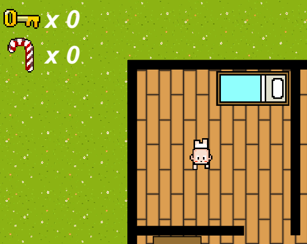

  
  <a href="https://sendit-studios.github.io/">Back to Home</a>  

# How to Play

 

> As a baby, you are able to move with **W**, **A**, **S**, **D**. 

 

> Select a weapon/power up with **1**, **2**, **3**, **4**, **q**, **e**

> Diapers are the default selected weapon which can stun the enemy for a brief period of time. With diapers selected, they will be fired in the direction of the arrow key pressed 

> If a burrito is collected, press **e** at any time to take a really stinky poop that can blow away anything within the range of smell

> Legos can be dropped by pressing **4**. Legos will cause the enemy to slow down while they walk off their recently acquired foot wound.

> The zap gun can be used to blow your enemy to smithereens. Simply press **3** and then the arrow key to fire in that direction. 

> Rack up your felony count by pressing **q**, then shoot it with the arrow key corresponding to the direction of fire. You will be able to unleash the rage of millions of babies whose candy was stolen from them.

> Always remember reselect the diaper ammo if using another projectile!!!

 

> The goal of the game is to locate the sweet sweet candy. However some are behind locked doors, so you must search for items such as keys and other collectibles to help you steal the candy.

 

> Once you have collected all the candy possible, its up to you to escape at the extraction point to secure the goods!

 

> However if you get caught it is game over!

 
