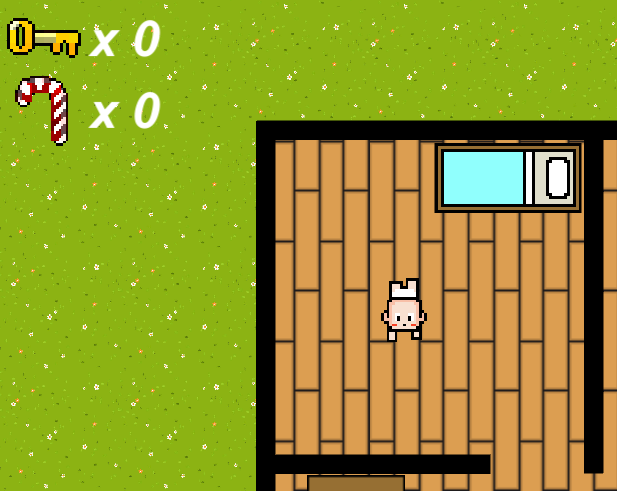
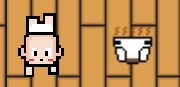
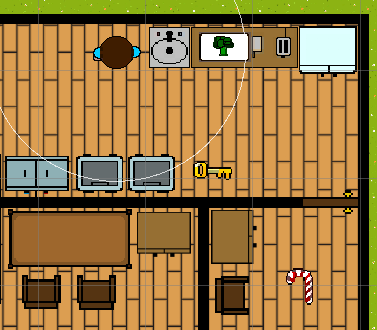
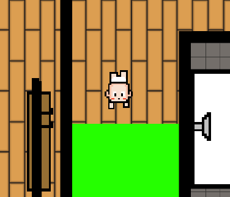

* [SendIt Studios Organization](https://github.com/SendIt-Studios)
* [M1 Project Board](https://github.com/orgs/SendIt-Studios/projects/2/views/1)

## Table of Contents
* [Overview](#overview)
* [User Guide](#user-guide)
* [Milestones](#milestones)
* [Team Members](#team-members)

## Overview

 Revenge of the Babies is a top-down stealth based 2D game where you play as a mischievous baby with a sweet tooh. Your ultimate goal is to sneak around your home undetected by your parents, while trying to steal as much candy as possible and get to the extraction point. The game takes place in a cozy suburban home with different rooms to explore, such as the living room, kitchen, bedroom, and bathroom. Your parents will be patrolling the house, patrolling between different areas and occasionally stopping to look around, so you must use your brain and maneuver to avoid getting caught.

As you move around the house, you'll encounter obstables, such as furniture and other objects that may obstruct your goal of stealing the sweet delicious candy. You'll need to search for hiding places to stay out of sight when your parents are nearby or use items you find along the way to distract, or slow down your parents. Special items and abilities are scattered around the house, some of which are locked behind a door so you'll need to strategize the best path to take.

## How to Play

As a baby, you are able to move using the Arrow Keys: Up, Down, Left, Right OR with W, A, S, D. 

 

##

With the press of SPACE, you have the inate ability to shoot stink diaper projectiles towards a target. The target that is hit will be stunned for a short duration, buying you time to carryy out your mission.

 

##

The goal of the game is to locate the sweet sweet candy. However some are behind locked doors, so you must search for items such as keys and other collectibles to help you steal the candy.

 

##

Once you have collected all the candy possible, its up to you to escape at the extraction point to secure the goods!

 

## The Beginning Stages of Development: Storyboard

The following are pictures of the earliest versions of our game. 

The Triangle represents a key, the blue square represents a candy, the red square represents a baby, and the green circle represents a dirty diaper.
The evacuation area is the green box but is only accessible when the candy has been obtained.

## 

The Goal is to avoid the parents at all costs because if they catch you, its GAME OVER! Pay attention to where the candy is because there are tricks and traps throughout the map. Use your diaper to stun the enemies and make your escape if detected. Obtain the keys to open doors and obtain any candy that might be behind them.

## Mischievous Baby Sprites

The baby will have a variety of items to collect and use against the parents.

## Parent Sprites

The patrolling parents that will be on alert to catch the baby out of its room.

## Team Members
* Nicholas Carr
    * [Portfolio](https://nicholasbcarr.github.io/)
    
* Eric Song
    * [Portfolio](https://eric-song1773.github.io/)
    
* Steven 
    * [Portfolio](https://sle417.github.io/)
    
* Gunwook
    * [Portfolio](https://lumd2000.github.io/)
    
