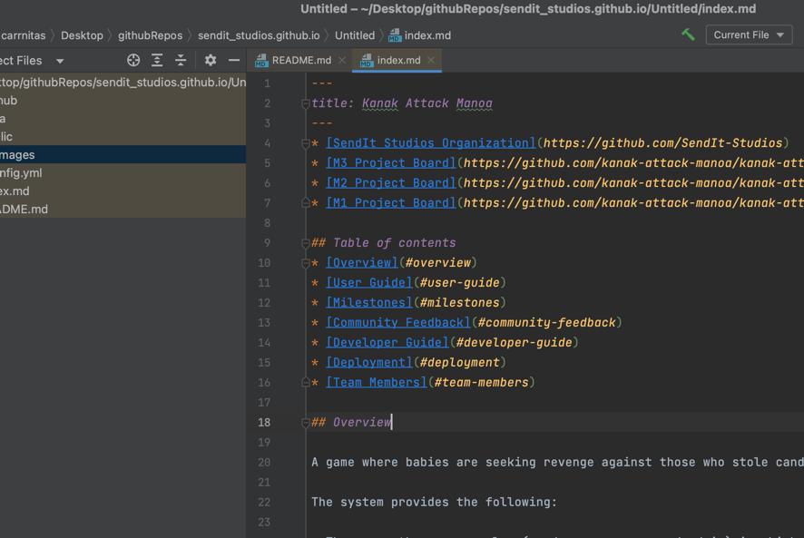

* [SendIt Studios Organization](https://github.com/SendIt-Studios)
* [M1 Project Board](https://github.com/orgs/SendIt-Studios/projects/2/views/1)

## Table of contents
* [Overview](#overview)
* [User Guide](#user-guide)
* [Milestones](#milestones)
* [Team Members](#team-members)

## Overview

A game where babies are seeking revenge against those who stole candy from them because it was "too easy"...

The system provides the following:

* Top down, 2D/3D view
* Characters are looking for you so be stealthy
* Use the environment to find ways to get the candy
* Use your arsenal to distract or confuse the adults to leave candy vulnerable
* Controls:

## Bad Baby Sprite

## Mad Dad Sprites

## Team Members
* Nicholas Carr
    * [Portfolio](https://nicholasbcarr.github.io/)
* Eric Song
    * [Portfolio](https://jeanne8879.github.io/)
* Steven 
    * [Portfolio](https://gavinh123.github.io/)
* Gunwook
    * [Portfolio](https://lumd2000.github.io/)

