* [SendIt Studios Organization](https://github.com/SendIt-Studios)
* [M1 Project Board](https://github.com/orgs/SendIt-Studios/projects/2/views/1)

## Table of Contents
* [How to Play](./how-to-play.html)
* [Storyboard](#the-beginning-stages-of-development-storyboard)
* [Team Members](./about-us.html)

## Overview

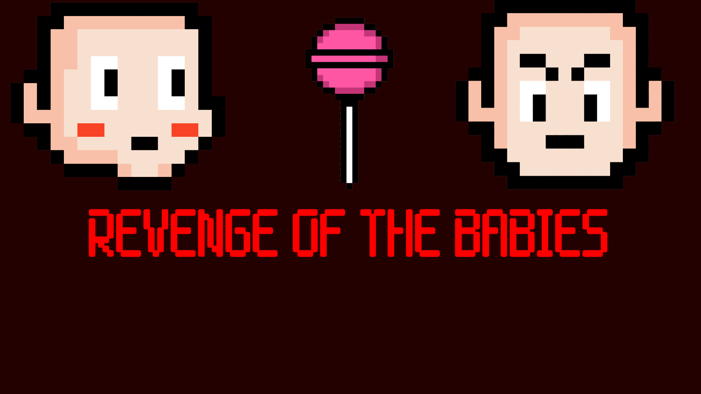 Revenge of the Babies is a top-down stealth based 2D game where you play as a mischievous baby with a sweet tooh. Your ultimate goal is to sneak around your home undetected by your parents, while trying to steal as much candy as possible and get to the extraction point. The game takes place in a cozy suburban home with different rooms to explore, such as the living room, kitchen, bedroom, and bathroom. Your parents will be patrolling the house, patrolling between different areas and occasionally stopping to look around, so you must use your brain and maneuver to avoid getting caught.

As you move around the house, you'll encounter obstables, such as furniture and other objects that may obstruct your goal of stealing the sweet delicious candy. You'll need to search for hiding places to stay out of sight when your parents are nearby or use items you find along the way to distract, or slow down your parents. Special items and abilities are scattered around the house, some of which are locked behind a door so you'll need to strategize the best path to take.

## The Beginning Stages of Development: Storyboard

The following are pictures of the earliest versions of our game. 

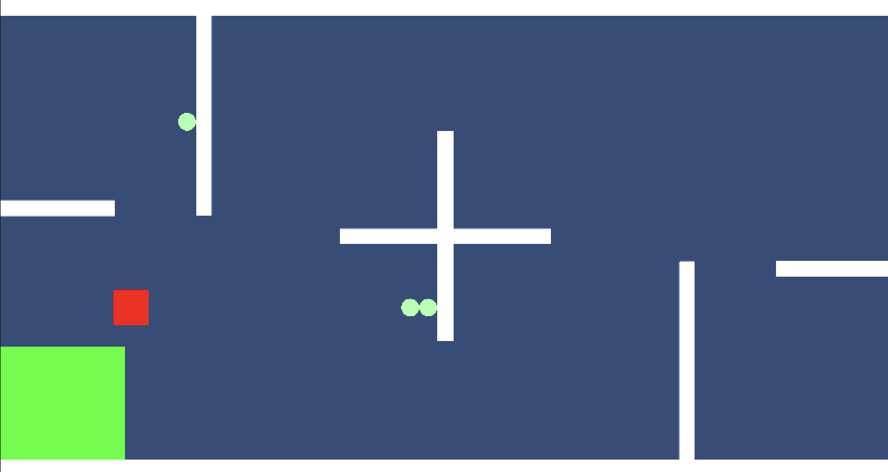

The Triangle represents a key, the blue square represents a candy, the red square represents a baby, and the green circle represents a dirty diaper.
The evacuation area is the green box but is only accessible when the candy has been obtained.

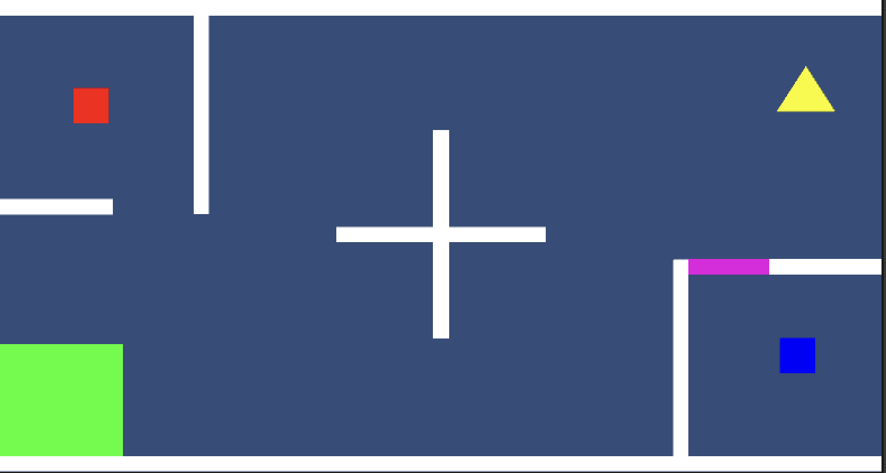

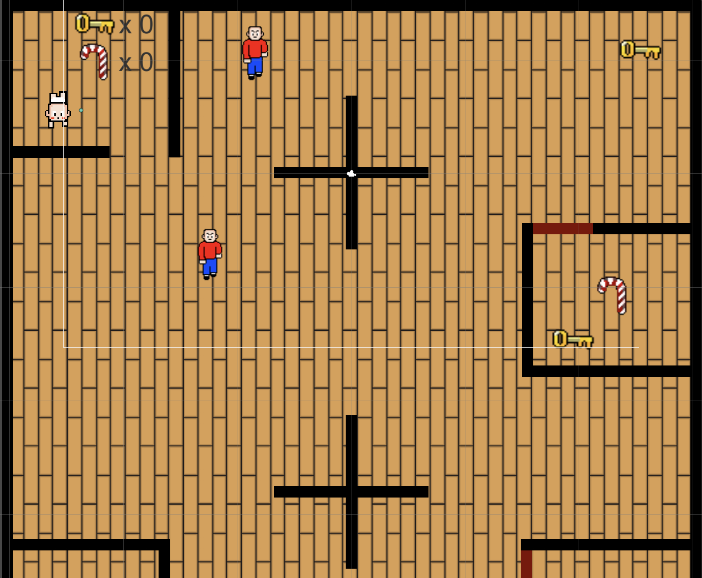

This was the first version of our Level 1 Scene that we drafted up. It featured the core functionality of the game such as character movement, parent patrolling, item collection, and an extraction point.

## Mischievous Baby Sprites

The baby will have a variety of items to collect and use against the parents.

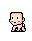
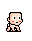
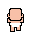
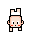

## Parent Sprites

The patrolling parents that will be on alert to catch the baby out of its room.

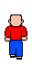
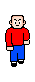
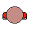
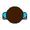

## First Prototype

The current state of our game and our very first protytype features a fully furnished home with two parents: Mom and Dad that patroll different areas. Candies are spread throughout the house and some require a key to collect.

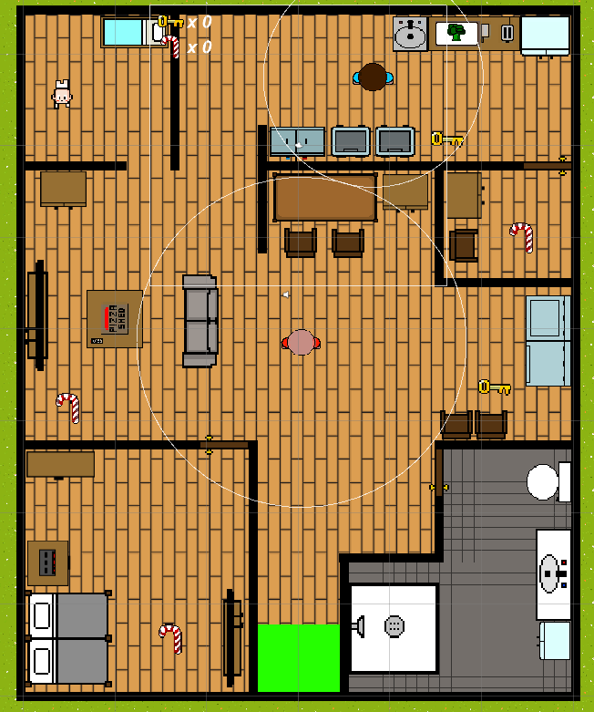

