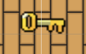
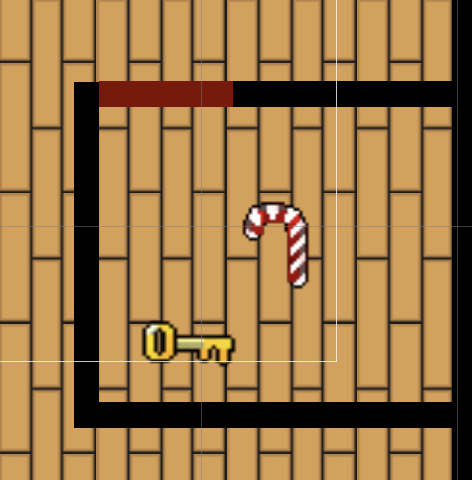
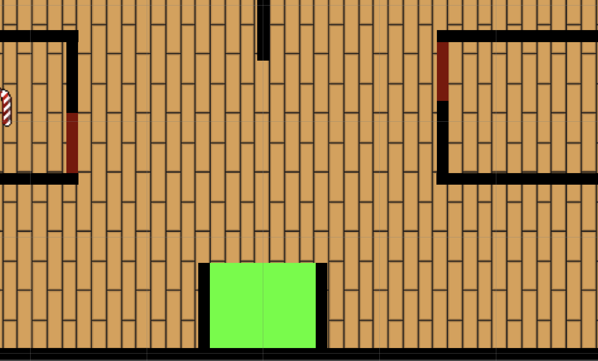
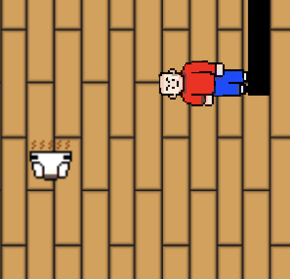

* [SendIt Studios Organization](https://github.com/SendIt-Studios)
* [M1 Project Board](https://github.com/orgs/SendIt-Studios/projects/2/views/1)

## Table of Contents
* [Overview](#overview)
* [User Guide](#user-guide)
* [Milestones](#milestones)
* [Team Members](#team-members)

## Overview

 Revenge of the Babies is a top-down stealth based 2D game where you play as a mischievous baby with a sweet tooh. Your ultimate goal is to sneak around your home undetected by your parents, while trying to steal as much candy as possible and get to the extraction point. The game takes place in a cozy suburban home with different rooms to explore, such as the living room, kitchen, bedroom, and bathroom. Your parents will be patrolling the house, patrolling between different areas and occasionally stopping to look around, so you must use your brain and maneuver to avoid getting caught.

As you move around the house, you'll encounter obstables, such as furniture and other objects that may obstruct your goal of stealing the sweet delicious candy. You'll need to search for hiding places to stay out of sight when your parents are nearby or use items you find along the way to distract, or slow down your parents. Special items and abilities are scattered around the house, some of which are locked behind a door so you'll need to strategize the best path to take.

## Overview!

The Triangle represents a key, the blue square represents a candy, the red square represents a baby, and the green circle represents a dirty diaper.
The evacuation area is the green box but is only accessible when the candy has been obtained.

A game where babies are seeking revenge against those who stole candy from them because it was "too easy"...

The system provides the following:

* Top down, 2D/3D view
* Characters are looking for you so be stealthy
* Use the environment to find ways to get the candy
* Use your arsenal to distract or confuse the adults to leave candy vulnerable

## Beggining Stages

The Goal is to avoid the parents at all costs because if they catch you, its GAME OVER! Pay attention to where the candy is because there are tricks and traps throughout the map. Use your diaper to stun the enemies and make your escape if detected. Obtain the keys to open doors and obtain any candy that might be behind them.

### Keys

Obtain keys to open the doors to access what is behind them.

### Doors and Candy

Stealing back the candy the adults took from you (because of how easy it was) is the reason you here, don't leave any behind!

### Evacuation Zone

The evacuation zone is always accessible, make sure you have thouroughly searched the map for everything you want before entering

## Controls

Arrow keys or a,w,s,d: crawl
Space bar: throw diaper

## Bad Baby Sprites

Bad baby will have a variety of items to collect and use.

## Mad Dad Sprites

One of the enemies seeking to capture bad baby.

## Team Members
* Nicholas Carr
    * [Portfolio](https://nicholasbcarr.github.io/)
    
    
* Eric Song
    * [Portfolio](https://eric-song1773.github.io/)
    
    
* Steven 
    * [Portfolio](https://sle417.github.io/)
    
    
* Gunwook
    * [Portfolio](https://lumd2000.github.io/)
    
    
