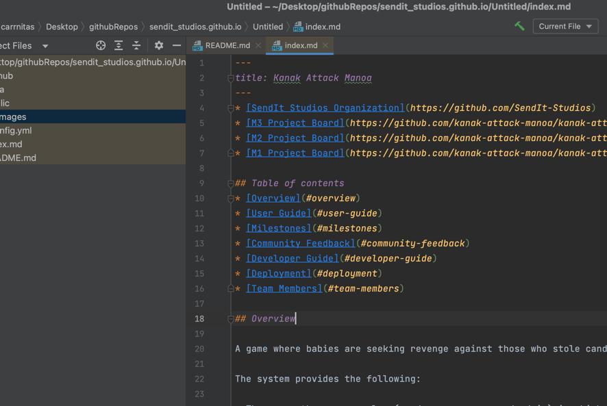

* [SendIt Studios Organization](https://github.com/SendIt-Studios)
* [M3 Project Board](https://github.com/kanak-attack-manoa/kanak-attack-manoa/projects/3)
* [M2 Project Board](https://github.com/kanak-attack-manoa/kanak-attack-manoa/projects/2)
* [M1 Project Board](https://github.com/kanak-attack-manoa/kanak-attack-manoa/projects/1)

## Table of contents
* [Overview](#overview)
* [User Guide](#user-guide)
* [Milestones](#milestones)
* [Team Members](#team-members)

## Overview

A game where babies are seeking revenge against those who stole candy from them because it was "too easy"...

The system provides the following:

* There are three user roles (vendor, consumer, and admin) in which the vendors can update the app to include available menu options, changes, or specials.
* Top-level index pages for Food and Vendors.
* Initialization code to define Vendors and Foods and relations between them.
* The ability to leave reviews for vendors.
* Accessing the menu page, vendor page, and review pages requires user-level authorization, while editing menu data and vendor profiles requires either vendor-level or admin-level authorization.

## User Guide

## Team Members
* Nicholas Carr
    * [Portfolio](https://nicholasbcarr.github.io/)
* Eric Song
    * [Portfolio](https://jeanne8879.github.io/)
* Steven 
    * [Portfolio](https://gavinh123.github.io/)
* Gunwook
    * [Portfolio](https://lumd2000.github.io/)

