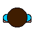

# The Beginning Stages of Development: Storyboard

> The following are pictures of the earliest versions of our game. 

> The Triangle represents a key, the blue square represents a candy, the red square represents a baby, and the green circle represents a dirty diaper.
> The evacuation area is the green box but is only accessible when the candy has been obtained.

> This was the first version of our Level 1 Scene that we drafted up. It featured the core functionality of the game such as character movement, parent patrolling, item collection, and an extraction point.

# Mischievous Baby Sprites

> The baby will have a variety of items to collect and use against the parents.

# Parent Sprites

> The patrolling parents that will be on alert to catch the baby out of its room.

# First Prototype

> The current state of our game and our very first protytype features a fully furnished home with two parents: Mom and Dad that patroll different areas. Candies are spread throughout the house and some require a key to collect.

